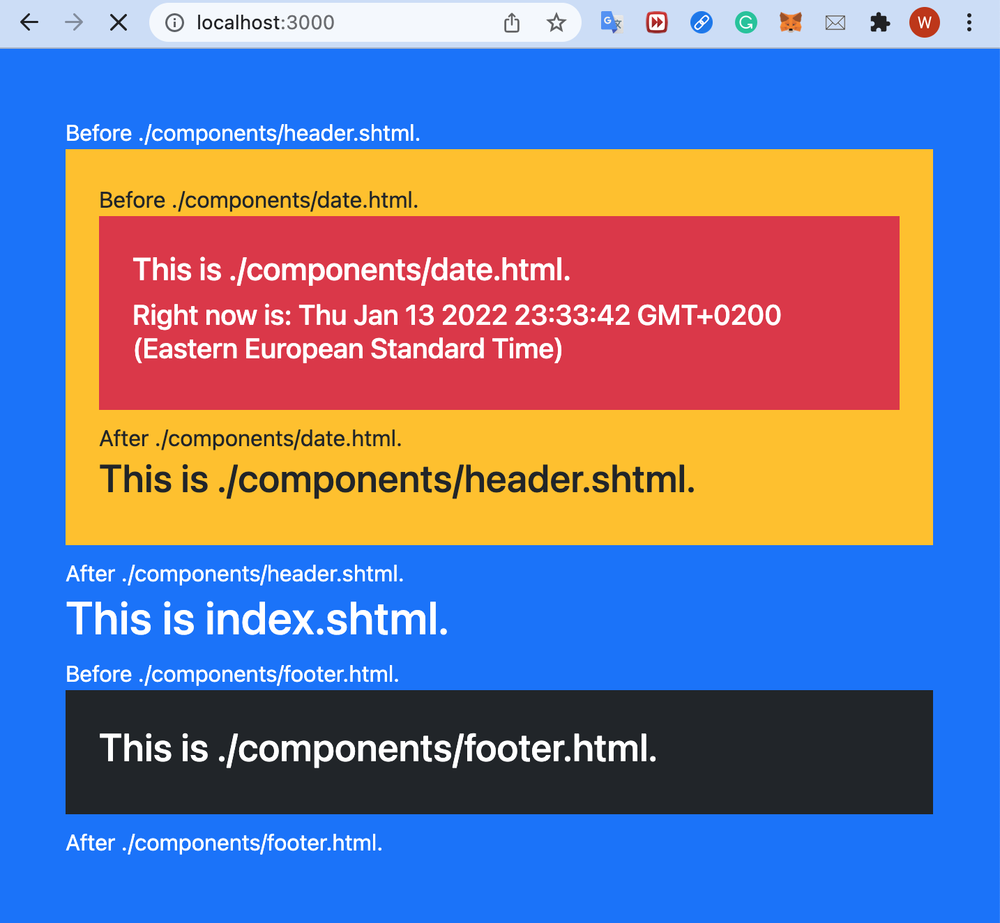

# nodejs-server-ssi

## Install

```bash
$ npm i nodejs-server-ssi
```

## Usage: `include` directive

### Syntax

```html
<!--#include file="./header.shtml" -->
<!--#include file="./components/header.shtml" -->
```

ps. The file path should be relative.

1. Create an NPM project folder and install the `nodejs-server-ssi` module.

    ```bash
    # bash
    $ mkdir <yourProject>
    $ cd <yourProject>
    $ npm init -y
    $ npm i nodejs-server-ssi
    ```

2. (Optional for testing) Clone this repo and copy the `public` folder inside the `tests` folder to your project folder.

    ```bash
    # bash
    $ git clone https://github.com/cv47522/nodejs-server-ssi.git
    $ cp -R path/to/nodejs-server-ssi/tests/public path/to/<yourProject>
    ```

3. (Optional) Or create your own HTML/SHTML files following the above `include` directive syntax.

4. Create an `index.js` and import the module. (**ps.**, The server of the module can be started **with or without specifying a port and a file directory since it has its default values**.)

    ```bash
    # bash
    $ cd <yourProject>
    $ touch index.js
    ```

    index.js

    ```javascript
    const path = require('path');
    const ssiServer = require('nodejs-server-ssi');

    const staticRoot = path.join(__dirname, 'public');
    const homepage = path.join(staticRoot, 'index.shtml');

    ssiServer();
    // or use specific homepage
    // ssiServer(staticRoot, homepage);
    // or use specific port
    // ssiServer(staticRoot, homepage, 5000);
    ```

5. Start the server by running the `index.js`.

   ```bash
   # bash
   $ node .
   ```

6. Go to (default) <http://localhost:3000>.
    

## Implementation

### Reference

- <https://github.com/kidwm/node-ssi>
- <https://github.com/jiamao/jm-ssi>

### External Libraries and Tools

- [express](https://www.npmjs.com/package/express): for conveniently creating an http server
- [serve-favicon](https://www.npmjs.com/package/serve-favicon): for serving a static favicon file
- [nodemon](https://www.npmjs.com/package/nodemon): for automatically restarting a node.js server after modifying files
- [VS Code Node.js Debugger](https://youtu.be/2oFKNL7vYV8): for tracing every parameter change

### Workflow

First, I created an http server serving a simple webpage with the `express` framework inside `index.js`. Next, I referenced some `ssi` repositories given above to implement the `<!--#include file="myFile.shtml" -->` SSI directive inside the `lib` folder. Then, I imported the SSI functionality to the `index.js` and exported this file as a `ssiServer` module. Since the `ssiServer` module should have its default port and static files to serve, I added some HTML and SHTML files to the `public` folder.

Finally, I added an example file `testInclude.js` to the `tests` along with some other HTML and SHTML files to test my `nodejs-server-ssi` project, packaged the whole project as an NPM module, and published it to <https://www.npmjs.com/package/nodejs-server-ssi>.

During the development, I always used the `nodemon` module to automatically reload the server whenever changing a file and debugged my Node.js project inside VS Code.

### Design Pattern

#### Factory

The project mostly uses the factory pattern to define a generic interface for creating objects since it is useful and easier to maintain when the creation process is complex.

ssiContentGenerator.js

```javascript
const ssiDecoder = require('./ssiDecoder');

const ssiContentGenerator = (rawHtml, options) => {
    options = options || {};
    options.data = options.data || {};
    options.root = options.root || '';

    return new Promise(async (resolve, reject) => {
        try {
            const htmlToJs = await ssiDecoder.decode(rawHtml, options);
            const result = generateHtml(htmlToJs, options.data);
            resolve(result);
        } catch(err) {
            reject(err);
        }
    });
}

module.exports = ssiContentGenerator;
```
